# Codebase Onboarding Guide

> Verified against the current workspace on 2026-09-03. The live code is the source of truth; `docs/PROJECT_HANDOFF.md`, `docs/PROJECT_ISSUES.md`, and the tests were used as supporting evidence.

Suggested reading order after this guide: `README.md` → `harness/runner.py` → `models/contracts.py` and `models/backends.py` → `intent_classifier.py` → `memory_core.py` → `documents/index.py` → `tools/manager.py` and `tools/registry.py` → one user interface (`chat.py` or the route/helper sections of `webapp.py`) → the corresponding tests.

## 1. One-line summary

This project is a private assistant that runs an AI model on your own computer, remembers useful personal facts, answers from your local documents, and safely performs a small set of real-world tasks.

## 2. Problem and purpose

### What problem it solves

A bare local language model can chat, but it has four practical shortcomings:

1. It forgets durable user facts between runs.
2. It cannot reliably answer from private local files.
3. It cannot obtain live data or safely act on files by itself.
4. Its model-specific prompting and tool syntax tend to leak into application logic, making models hard to replace.

This repository wraps a local causal language model in a controlled application harness that adds:

- persistent, evidence-grounded user memory;
- retrieval-augmented generation (RAG) over local TXT/PDF knowledge;
- allowlisted and schema-validated tools;
- stateful terminal and browser interfaces;
- backend-independent model contracts and explicit model capabilities;
- bounded context, tool execution, logging, and web/file access.

### Who it is for

The intended deployment is a **single trusted user on one local machine**. That is explicit in `webapp.py` and explains why the server binds to `127.0.0.1`, why there is no account/signup model, and why authentication, CSRF protection, and rate limiting are absent. It is a personal/local assistant and an engineering test bed for safe orchestration—not a hosted multi-tenant SaaS product.

### Why it exists

The project explores how to turn a small local model into a useful assistant without surrendering control of private conversation, memory, and documents. The main engineering objective is not just generation quality: it is coordinating probabilistic model behavior with deterministic application guarantees around routing, persistence, tool execution, and safety.

## 3. High-level architecture

### Architecture in words

Imagine the system as five horizontal layers:

```text
Interfaces
  chat.py (stateful CLI) | infer.py (stateless CLI) | webapp.py (FastAPI + browser UI)
                                      |
                                      v
Application orchestration
  harness/runner.py::HarnessRunner
    |-- hybrid intent routing
    |-- prompt assembly and conversation compression
    |-- memory/document retrieval gating
    |-- bounded tool loop and result ledger
    `-- final response generation and run trace
          |                 |                 |                  |
          v                 v                 v                  v
Domain subsystems
  memory_core.py       documents/          tools/          tool_selectors.py
  durable facts        local RAG            allowlist       main model/Needle2
          |                 |                 |                  |
          v                 v                 v                  v
Infrastructure
  SQLite memory DB     SQLite vector index  local + HTTP    selector runtime
          \                 /                                  /
           \               /                                  /
            v             v                                  v
Model boundary
  models/contracts.py -> models/registry.py -> models/backends.py -> Transformers
                                                               -> Qwen / SmolLM2
```

All user-facing entry points construct the same `HarnessRunner`. The runner depends on interfaces and callbacks (`ModelBackend`, `ToolSelector`, `document_lookup`, and the memory manager), while implementation details live below those boundaries.

### Architectural pattern

This is a **modular monolith with ports-and-adapters characteristics**:

- **Monolith:** one Python process owns routing, model inference, persistence, tools, and the web UI. There are no independently deployed services, queues, brokers, or RPC boundaries.
- **Modular:** memory, documents, tools, model execution, and web session persistence have separate modules and stores.
- **Ports and adapters:** `models/contracts.py::ModelBackend` is the model port; `TransformersBackend` is its current adapter. `tool_selectors.py::ToolSelector` similarly separates selection policy from orchestration.
- **Pipeline/state machine:** `HarnessRunner.run()` creates a `RunState` and executes a staged turn pipeline. Tool-enabled turns become a bounded loop with explicit terminal outcomes.

This shape is appropriate for a local single-user application: it avoids distributed-system overhead while retaining replaceable boundaries around the expensive and model-specific parts.

### Component responsibilities

| Component | Responsibility | Important code |
| --- | --- | --- |
| Entry points | Configure and start a user interface | `chat.py`, `infer.py::main`, `webapp.py` routes/startup |
| Shared harness | Own one complete turn and all cross-subsystem policy | `harness/runner.py::HarnessRunner` |
| Intent router | Independently decide memory read/write, document read, tool use, and general chat | `intent_classifier.py::DeterministicIntentRouter`, `IntentClassifier` |
| Model abstraction | Describe, load, invoke, count tokens, and close a local model | `models/contracts.py`, `models/backends.py` |
| Memory | Extract, validate, version, cache, and retrieve user facts | `memory_core.py::OfflineMemoryManager` |
| Documents | Discover, extract, chunk, embed, index, route, and retrieve local knowledge | `documents/index.py::DocumentIndex` and supporting modules |
| Tools | Register, validate, execute, bound, and normalize utility calls | `tools/registry.py`, `tools/manager.py::ToolManager` |
| Tool selection | Ask either the active main model or optional Needle2 for calls | `tool_selectors.py` |
| Web sessions | Persist browser conversations independently of durable memory | `webapp.py` session helpers and SQLite tables |
| Diagnostics | Rotate logs, capture subsystem prints, and redact tool payloads | `logging_utils.py` |

### End-to-end data flow for a chat turn

1. An interface receives text and passes a `RunRequest` containing the current message, conversation list, turn number, and history policy to `HarnessRunner.run()`.
2. `HarnessRunner.classify_intent()` asks `DeterministicIntentRouter.analyze()` for per-flag evidence. High-confidence rules win; unresolved flags are classified by `IntentClassifier`, which asks the active model for exactly five booleans.
3. Very-low-confidence risky actions become `OrchestrationOutcome.ASK_USER`; the pipeline returns a clarification before retrieval, execution, or memory writes.
4. If `memory_read` is true, `OfflineMemoryManager.get_orchestrated_context()` performs an exact structured relation lookup first, then falls back to the hot cache plus semantic retrieval.
5. If `document_read` is true, `DocumentIndex.lookup_context()` first routes the query toward the document collection, then retrieves only chunks above the configured similarity threshold. Explicit filenames constrain the search.
6. `HarnessRunner.build_system_prompt()` injects only the memory and document context actually returned. The user message is added to history for stateful interfaces.
7. If the application context threshold is exceeded, `compress_context()` summarizes older complete turns while preserving the latest configured number of turns. Lowest-ranked document chunks can then be removed to reduce the prompt.
8. For ordinary turns, `generate_reply()` sends a backend-neutral `GenerationRequest` to `ModelBackend.generate()`.
9. For tool turns, `generate_tool_aware_reply()` exposes eligible schemas, obtains calls, parses and validates them through `ToolManager`, executes within a bounded loop, and appends ephemeral tool messages plus an immutable turn-local result ledger. It then asks the main model to synthesize the answer from successful results.
10. If `memory_write` is true, the model extracts `entity | relation | value | fact_sentence` candidates from the authoritative current or resolved prior user assertion. Python validates grounding, entity, relation, duplicates, and temporal conflicts before storing anything.
11. A `RunResult` returns the output, updated messages, retrieval metadata, tool ledger, and trace. The web path then persists only the user/final-assistant pair in its session database.

### Whole-system flowchart

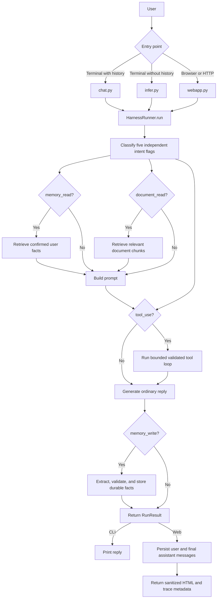

The important idea is that memory, documents, and tools are **optional branches**, not steps that run on every message. Intent routing decides which branches participate, and all branches meet again at prompt construction or final result creation.

### Startup flowcharts

The three interfaces build almost the same dependency graph, but they differ in when startup happens and whether conversation history is retained.

#### Stateful terminal startup: `chat.py`

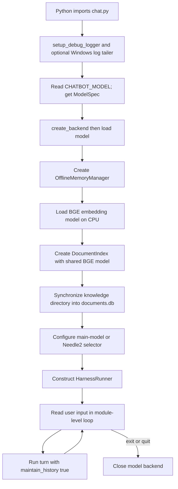

`chat.py` deliberately initializes at module scope. That makes it convenient as the canonical executable, but it also means importing it from another module would load the model and enter the input loop. Its `messages` list survives across turns, compression is enabled, and replies default to 300 new tokens.

#### Stateless terminal startup: `infer.py`

`infer.py::main()` performs the same logger → model → memory/BGE → document sync → selector → runner construction, but calls `RunRequest(..., maintain_history=False)`. The loop still has a turn number and can use durable memory/RAG, but the model receives no earlier conversational turns. This distinction is easy to miss: **stateless conversation does not mean stateless application data**.

#### Web startup: `webapp.py`

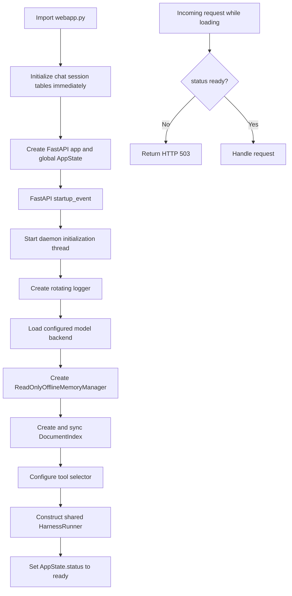

The background thread lets the server answer `/health` while large model weights are loading. Access to `AppState` is guarded by separate locks for initialization, generation/model switching, session storage, and document synchronization.

### Detailed turn flow inside `HarnessRunner`

`HarnessRunner.run()` is a small public wrapper around `_run_pipeline()`. It creates a fresh `RunState`, makes it the active trace target, delegates the actual work, copies the final subsystem results into the state, and emits routing/retrieval/output trace events. If an exception escapes, it records an `error` trace event and re-raises it.

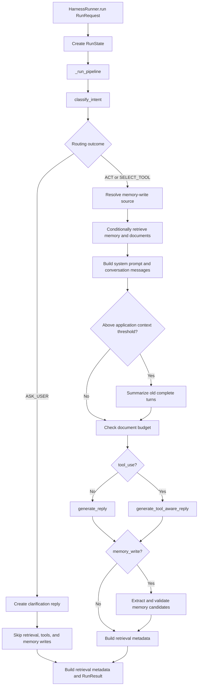

The main methods divide responsibilities as follows:

- `classify_intent()` merges rule-based and model-based evidence, applies enabled-capability switches, assigns `ACT`/`SELECT_TOOL`/`ASK_USER`, and records diagnostic sources and reasons.
- `build_system_prompt()` combines the base behavior prompt with only confirmed memory and retrieved document text. It gives both kinds of context explicit rules so the model does not reveal memory mechanics or treat missing document answers as known facts.
- `generate_reply()` is the one general model-call gateway. It translates simple keyword arguments into `GenerationRequest`, updates model-call trace information, and invokes the backend.
- `compress_context()` preserves the system message, the current pending user message, and the latest complete turns. It summarizes only older messages with a deterministic generation request.
- `_fit_document_context_to_budget()` removes document blocks from the end. Retrieval output is score-sorted, so this discards the lowest-ranked chunks first.
- `_build_retrieval_metadata()` creates the data later shown by the web UI without changing the text sent to the model.

### Intent-routing flowchart

The router does not choose one label. It produces five booleans that can be true together.

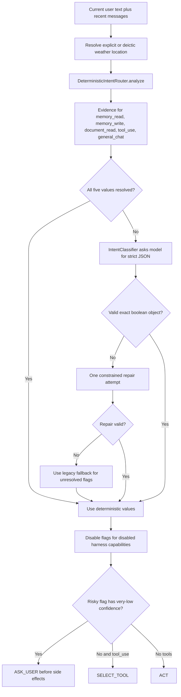

Concrete rule examples from `DeterministicIntentRouter`:

- “What is my name?” sets `memory_read` because it is a question with self-reference and a supported profile cue.
- “I live in Pune now” sets `memory_write` because it is a durable first-person assertion.
- “According to our travel policy…” sets `document_read` even without a filename because it asks for organization-specific knowledge.
- “Search the web for…” sets `tool_use`, while “How does web search work?” does not.
- “Read https://example.com” authorizes `fetch_webpage`; merely mentioning the same URL does not.
- “What is the weather there?” resolves a recent user-stated location when possible; otherwise the risky unresolved action becomes a clarification.
- “I moved to Pune, and explain recursion” can set both `memory_write` and `general_chat`.

`IntentClassifier.parse_decision()` is intentionally strict: the model must return exactly the five expected keys and real JSON booleans. Permissive parsing here would make routing errors less visible and could accidentally enable side effects.

### Model execution flowchart

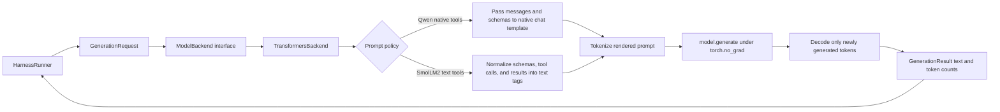

The boundary is important. `HarnessRunner` never imports PyTorch or Transformers and never checks whether the model name contains “Qwen” or “SmolLM.” `models/registry.py` declares what to load; `models/backends.py` owns how it is loaded and how messages are rendered.

`TransformersBackend.load()` also rejects unknown loading options instead of silently ignoring them. For Qwen it converts the declarative quantization map into `BitsAndBytesConfig`. `close()` removes tokenizer/model references, runs garbage collection, and releases cached CUDA memory when available.

### Memory write flowchart

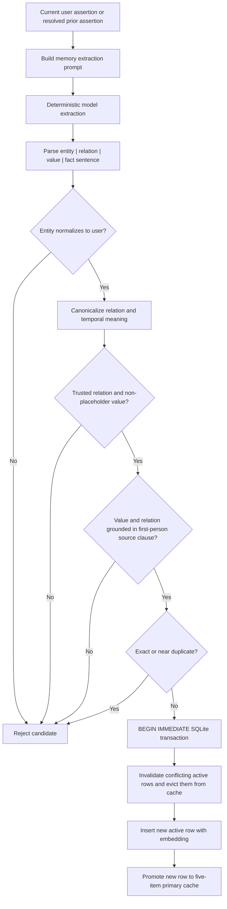

Several functions cooperate here:

- `normalize_entity()` accepts only `user`; it deliberately returns an empty value for every other person.
- `normalize_relation()` collapses known aliases to stable keys.
- `canonicalize_extracted_relation()` uses the candidate's nearby wording to keep “favorite language,” “recently coding in,” and “codes in” distinct.
- `fact_temporal_priority()` orders old values before current ones when a single message says “changed from X to Y.” This prevents model output order from deciding which value stays active.
- `_source_supports_user_fact()` walks sentences and clauses to distinguish the user's fact from facts about friends, coworkers, or other named people.
- `_fact_sentence_exists()` checks exact prose and same-relation/same-value semantic similarity at `0.96`.
- `add_fact_with_resolution()` revalidates, embeds, updates temporal state in a transaction, and promotes the new record.

### Memory read flowchart

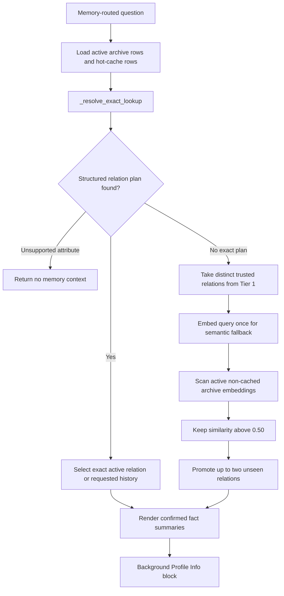

Exact lookup comes first because semantic similarity can confuse nearby concepts. A direct favorite-language question should not return a recently-used language merely because both sentences mention programming. Broad profile recall intentionally uses the hybrid cache/semantic path.

In CLI modes, retrieval may update `last_accessed` and promote Tier 2 hits. `webapp.py::ReadOnlyOfflineMemoryManager` sets `retrieval_mutates_cache=False`, so merely viewing facts through the browser does not change LRU state. This does **not** disable explicitly routed memory writes.

### Document ingestion and RAG flowcharts

#### Index synchronization

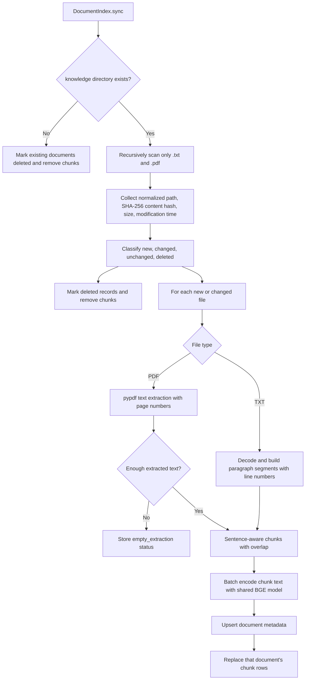

Unchanged files are cheap after discovery: they are hashed but not extracted or re-embedded. Changed files reuse the stable path-derived document ID and replace their chunks. A missing source file is retained as a `deleted` document record but has no active chunks.

#### Query-time retrieval

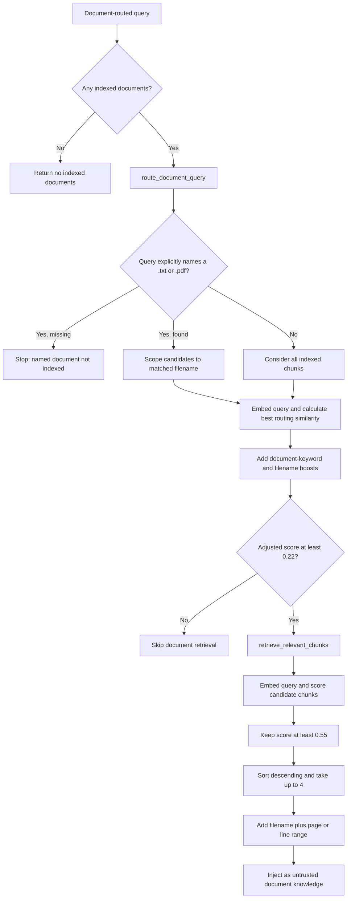

The explicit-filename stop is a safety/correctness rule, not an optimization. If the user asks for `missing_policy.pdf`, returning a similar real policy could create a confident answer from the wrong source.

### Tool-execution flowchart

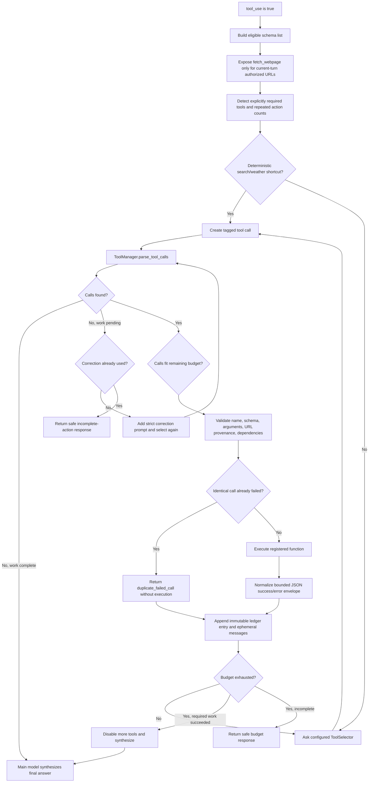

Why the loop looks more complicated than a normal function call:

- A model can emit zero, one, or multiple calls, and the output can be malformed.
- The user can request repeated identical successful actions, such as two die rolls. Those must stay separate.
- A repeated failed call should not hit the same file/network service indefinitely.
- A dependent calculator call must use actual earlier results, not placeholders or invented values.
- A dedicated selector such as Needle2 chooses calls but never writes the user-facing answer; final synthesis stays with the active main model.
- Tool results can be large or hostile. `_serialize_tool_payload()` and `_bound_tool_arguments()` preserve valid JSON while limiting how much enters the model context.
- The ledger tells the model which results are successful and authoritative. Discovery data cannot silently override dedicated structured results.

`ToolManager` itself has three clean stages:

1. `parse_tool_calls()` recovers supported tagged/native-like JSON call shapes while containing malformed calls as invalid pseudo-calls.
2. `validate_call()` finds the definition in `ToolRegistry`, validates its schema recursively, adds declared defaults, and normalizes tool-specific arguments.
3. `execute_validated()` invokes only the registered callable and converts its return or exception into `ToolExecutionResult`.

### Web chat request flowchart

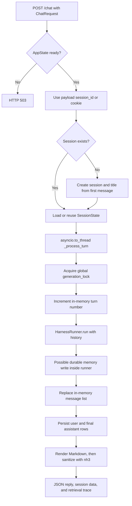

The `generation_lock` covers the entire turn, including the runner and persistence immediately after it. It also coordinates with `_switch_model()`, so a model cannot be unloaded midway through generation. Session database operations have their own lock because session endpoints can run outside model generation.

The persistence boundary is deliberately after orchestration: tool protocol messages, retrieval prompts, and summaries are not inserted into the `messages` table. Only the original user text and final assistant reply are stored.

### Module-by-module source walkthrough

#### Root modules

| File | Read it as | Key details |
| --- | --- | --- |
| `app_paths.py` | Runtime storage configuration | Centralizes project/data/database/log paths and environment overrides. Helpers elsewhere create parent directories only when necessary. |
| `chat.py` | Canonical terminal composition root | Constructs concrete dependencies, enables history/compression, and owns the interactive loop. |
| `infer.py` | Stateless composition root | Same core services, but `maintain_history=False`; `postprocess_reply()` removes accidental speaker tags. |
| `webapp.py` | Web composition root, HTTP API, persistence adapter, and embedded frontend | Defines request models, global state/locks, session DB access, upload management, startup/model switching, routes, and all browser HTML/CSS/JS. |
| `intent_classifier.py` | Hybrid routing policy | Contains deterministic phrase/reference analysis and strict model JSON classification/repair. |
| `memory_core.py` | Durable personal-memory domain and persistence | Owns relation normalization, grounding, duplicate/conflict handling, schema creation, cache promotion, structured lookup, and semantic fallback. |
| `tool_selectors.py` | Tool-choice strategy boundary | Defines main-model, compatibility, and optional Needle2 implementations. |
| `logging_utils.py` | Diagnostic and privacy utilities | Uses rotating logs, terminal formatting, stdout/stderr capture, URL/secret redaction, and an optional Windows live tailer. |
| `orchestrator.py` | Legacy import bridge | Re-exports `harness.runner`; no canonical behavior lives here. |
| `model_adapter.py` | Legacy model import bridge | Re-exports `models` contracts/backends for older callers. |

#### `harness/`

| File | Purpose |
| --- | --- |
| `harness/__init__.py` | Stable public imports for runner contracts and helpers. |
| `harness/runner.py` | Central application service. Owns turn state, routing merge, context injection, compression, tool state machine, memory extraction coordination, metadata, and trace events. |

The harness imports model **contracts**, not Transformer internals. It imports the memory/document services through passed objects or callbacks where practical. This is the architectural seam that keeps all entry points consistent.

#### `models/`

| File | Purpose |
| --- | --- |
| `models/contracts.py` | Immutable `ModelCapabilities`, `ModelSpec`, request/result DTOs, and abstract `ModelBackend`. |
| `models/registry.py` | Allowed selectable models and their declarative loading/prompt policies. |
| `models/backends.py` | Transformers loading, quantization conversion, token counting, chat-template rendering, generation, resource cleanup, and SmolLM2 protocol adaptation. |
| `models/__init__.py` | Public package exports. |

#### `documents/`

| File | Purpose |
| --- | --- |
| `documents/config.py` | RAG paths, thresholds, chunk settings, supported extensions, and routing keywords. |
| `documents/db.py` | SQLite connection context and the `documents`/`chunks` schema. |
| `documents/discovery.py` | Recursive scan, path-based IDs, file hashes, and sync classification. |
| `documents/extractors.py` | Pluggable extension-to-extractor registry; TXT decoding and PDF page extraction. |
| `documents/chunking.py` | Sentence-aware chunk construction with overlap and source location metadata. |
| `documents/router.py` | Low-threshold collection routing, keyword boost, and exact filename matching. |
| `documents/retrieval.py` | Higher-threshold chunk ranking, top-K selection, and source formatting. |
| `documents/index.py` | Facade coordinating every indexing and lookup step. Entry points normally use only `DocumentIndex`. |

Routing and retrieval use separate thresholds because they answer different questions. The router asks “does this request belong to local documents at all?” with a permissive `0.22` threshold plus boosts. Retrieval asks “is this exact chunk good enough to show the model?” with a stricter `0.55` threshold.

#### `tools/`

| File | Purpose |
| --- | --- |
| `tools/config.py` | Bounds for calls, timeouts, bytes, result/context characters, paths, spreadsheets, calculator, forecasts, currencies, and search. |
| `tools/registry.py` | Sole execution allowlist and model-facing schemas. |
| `tools/manager.py` | Parsing, recursive schema validation, execution dispatch, error envelopes, JSON normalization, and result bounding. |
| `tools/common.py` | Shared `ToolError`, root-safe file resolution, ZIP expansion validation, text truncation, and SSRF-resistant public URL checks. |
| `tools/calculator.py` | Restricted arithmetic AST and numeric aggregates. |
| `tools/random_tools.py` | Die rolls and bounded random integers. |
| `tools/currency_exchange.py` | Frankfurter rate lookup, decimal-safe conversion, date/provider validation, and bounded response reading. |
| `tools/weather.py` | Open-Meteo geocoding, current conditions, and short forecast normalization. |
| `tools/web_search.py` | Tavily request/authentication and bounded, cleaned result metadata. |
| `tools/web_fetch.py` | Redirect-aware public-page retrieval and readable text extraction. |
| `tools/file_reader.py` | One-off bounded reads/previews for TXT, CSV, JSON, DOCX, PDF, and XLSX without RAG ingestion. |
| `tools/directory_listing.py` | Root-confined, bounded, optionally recursive directory listing with filters. |
| `tools/spreadsheet.py` | Declarative multi-file CSV/XLSX select/filter/group/aggregate/sort/limit pipeline. |
| `tools/definitions.py` | Small compatibility export for older basic-tool imports; not the registry. |

There is an important distinction between `documents/` and file tools. `documents/` builds a persistent semantic knowledge index from `knowledge/`. `read_file` reads one explicit file for one tool turn and does not ingest or persist it. `analyze_spreadsheet` performs deterministic structured operations instead of asking the model to reason over an unbounded raw workbook.

### Which state lives where

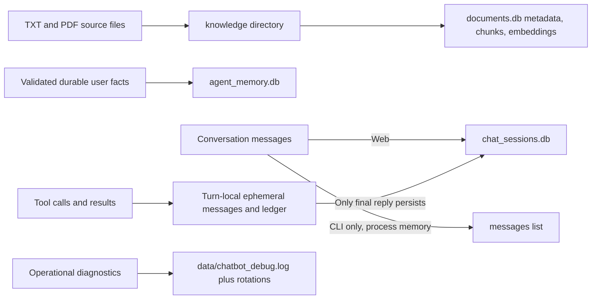

This separation answers a common onboarding question: deleting a browser session does not delete durable memory or indexed documents; updating memory does not alter chat rows; a tool result does not become durable memory unless the user's own text independently qualifies for a grounded memory write.

### Worked end-to-end example

Suppose the browser user sends:

> I moved to Pune. What is the weather there?

Here is what the code does, in order:

1. `webapp.py::chat()` validates the message through `ChatRequest`, finds or creates the browser session, and sends `_process_turn()` to a worker thread.
2. `_process_turn()` takes `APP_STATE.generation_lock`, increments the session's turn number, and calls `HarnessRunner.run()` with the session's current message list.
3. `HarnessRunner.classify_intent()` first calls `resolve_weather_reference()`. `explicit_current_turn_location()` extracts `Pune` from “I moved to Pune,” and the deictic word “there” is therefore resolvable without guessing.
4. `DeterministicIntentRouter.analyze()` independently sets:

   ```text
   memory_read  = false   # the user is not asking for an old personal fact
   memory_write = true    # “I moved to Pune” is a durable first-person location update
   document_read = false  # no local-document evidence is requested
   tool_use = true        # current weather needs an external tool
   general_chat = false   # the requested answer is covered by the tool path
   ```

5. `_run_pipeline()` keeps the whole current message as the authoritative memory extraction source. It skips memory retrieval and document retrieval because their read flags are false.
6. `build_system_prompt()` therefore uses only the normal assistant prompt—no unrelated memory profile and no document text.
7. `generate_tool_aware_reply()` sees the already-resolved `weather.place=Pune`. Instead of trusting the model to resolve “there,” it emits a deterministic `weather` call and later forces `place` back to `Pune` even if the proposed arguments differ.
8. `ToolManager.validate_call()` matches `weather` to its registry definition, selects the “place” schema branch, supplies the default `forecast_days=3`, and rejects any unknown argument.
9. `tools/weather.py::weather()` calls Open-Meteo geocoding, obtains coordinates, calls the forecast endpoint, verifies required fields, and returns normalized current/forecast data.
10. The runner stores that successful attempt in the turn-local ledger, gives the structured result back to the main model, and generates a natural answer grounded in the returned weather values.
11. Only after the reply exists does the memory-write phase call `build_router_messages()` for “I moved to Pune.” The model proposes a `user | lives_in | Pune | ...` record.
12. Python verifies that `Pune` appears in a first-person location clause. If another active `lives_in` value exists, `add_fact_with_resolution()` marks it inactive, inserts the new fact, embeds it, and promotes it to the hot cache.
13. `HarnessRunner.run()` adds routing, model, tool, memory-retrieval, document-retrieval, and final-output trace events to `RunState` and returns `RunResult`.
14. `_process_turn()` updates the in-memory session and inserts exactly two chat rows: the original user message and final assistant answer. It does not persist the weather tool protocol or result ledger in chat history.
15. `_render_assistant_markdown()` renders the final Markdown and `nh3.clean()` removes unsafe HTML/URLs before the response reaches the browser.

This one message demonstrates the project's central idea: deterministic application code can combine a memory update and a live tool action in the same turn, while the language model handles extraction and wording but does not control validation or persistence policy.

## 4. Tech stack breakdown

The “why” column is an engineering inference from how each dependency is used.

| Technology | Where used | Why it fits here / tradeoff |
| --- | --- | --- |
| Python 3.11+ | Entire application | Strong ML ecosystem and fast iteration. Dynamic typing makes orchestration concise, but runtime validation and tests carry more responsibility. |
| PyTorch | `models/backends.py` | Executes local transformer inference and CUDA tensors. Powerful and standard, but GPU/platform compatibility is a deployment risk. |
| Hugging Face Transformers | `TransformersBackend` | Provides tokenizer chat templates, causal-LM loading, and generation for Qwen/SmolLM2. It accelerates model support but version changes can affect prompts and loading. |
| bitsandbytes | Qwen model spec/backend | 4-bit NF4 quantization makes a 3B model practical on the documented 6 GB-class GPU. It reduces VRAM at the cost of platform complexity and some quantization loss. |
| Accelerate | Transformers runtime | Supports automatic device placement through `device_map="auto"`. Convenient locally, but abstracts placement details that can complicate diagnostics. |
| Sentence Transformers | `memory_core.py`, `documents/` | Runs `BAAI/bge-small-en-v1.5` embeddings for semantic memory/document search. One shared CPU model preserves GPU VRAM, trading latency for capacity. |
| NumPy | memory and document retrieval | Stores/loads float32 vectors and computes cosine similarity without a vector database. Excellent for a modest local corpus; brute-force scans do not scale far. |
| SQLite | three independent stores | Zero-service, transactional, portable local persistence. Separate DBs reduce coupling; they also prevent cross-store transactions and duplicate some plumbing. |
| FastAPI + Uvicorn | `webapp.py` | Typed request validation, simple async endpoints, and a lightweight local server. `asyncio.to_thread()` keeps blocking model work off the event loop, while a lock still serializes generation. |
| Pydantic | web request DTOs | Enforces chat/model payload size and shape at the HTTP boundary. |
| markdown-it-py + nh3 | web reply rendering | Renders assistant Markdown and then sanitizes it, preventing raw model HTML/script from becoming executable UI content. |
| requests | weather, exchange rates, web search/fetch | Familiar synchronous HTTP API that matches the sequential tool loop. It blocks threads and is not optimized for high concurrency, which is acceptable for the local design. |
| Beautiful Soup | `tools/web_fetch.py` | Extracts readable text from bounded public HTML. It is pragmatic but not a browser and cannot render JavaScript-heavy/authenticated pages. |
| pypdf | RAG ingestion and one-off file reads | Extracts text from normal PDFs locally. It does not provide OCR, so scanned PDFs are rejected as empty extraction. |
| openpyxl + python-docx | file/spreadsheet tools | Reads common Office formats locally without external services. ZIP expansion checks mitigate archive-bomb risk. |
| colorama + Python logging | CLI and diagnostics | Improves Windows terminal output and supplies rotating local logs. |
| pytest | regression suite | Fakes models/network and uses temporary databases so normal validation is deterministic and does not require Qwen or user data. |
| Optional Needle2 (`needle`) | `tool_selectors.py` | A dedicated selector can improve tool-call choice without becoming the answer model. It is optional because it adds a native runtime and dependency surface. |

### Configured models

`models/registry.py::MODEL_REGISTRY` contains declarative specifications, not loader functions:

- `qwen`: `Qwen/Qwen2.5-3B-Instruct`, native tool-aware chat template, 4-bit NF4, BF16 compute, double quantization, automatic device mapping.
- `smollm2`: `HuggingFaceTB/SmolLM2-1.7B-Instruct`, non-quantized, with a compact textual tool protocol implemented by `SmolLM2ToolPromptPolicy`.

The supported promise is deliberately narrow: compatible local causal models supported by an installed backend—not universal model compatibility.

## 5. Core entities and domain model

### Runtime orchestration objects

- `RunRequest`: user input, mutable conversation messages, turn number, history mode, and optional output cleanup hooks.
- `RunState`: trace, routing decision, retrieved contexts, tool ledger, model-call count, and final output for one run.
- `RunResult`: final output plus updated messages and the inspectable `RunState`.
- `IntentDecision`: five independent booleans: `memory_read`, `memory_write`, `document_read`, `tool_use`, and `general_chat`.
- `RoutingDecision`: resolved intent, confidence evidence, outcome (`ACT`, `SELECT_TOOL`, or `ASK_USER`), and optional clarification.
- `GenerationRequest` / `GenerationResult`: backend-neutral model invocation and response contracts.
- `ModelSpec` / `ModelCapabilities`: model identity, backend, supported features, and declarative load options.
- `ToolCall` / `ToolExecutionResult`: untrusted proposed invocation and normalized success/error envelope.
- `ToolResultLedgerEntry`: immutable ordered record of every tool attempt in the current turn.
- `DocumentRetrievalResult` and retrieval metadata classes: context plus whether/how memory or document evidence was injected.

### Memory database: `agent_memory.db`

Initialized by `OfflineMemoryManager._init_db()`:

```text
global_archive
  id PK, entity, relation, value, fact_sentence, embedding BLOB,
  created_at, invalidated_at, is_active

primary_cache
  id PK, archive_id, fact_sentence, last_accessed
```

`global_archive` is the durable temporal record. A new conflicting value invalidates the old row rather than deleting it. `primary_cache` is a five-row LRU-style hot set; it is operational acceleration, not the source of truth.

The only valid entity is canonical `user`. Trusted relations are:

- `name`
- `lives_in`
- `works_in`
- `codes_in`
- `favorite_programming_language`
- `recently_codes_in`
- `prefers_beverage`
- `changed_mind*` compatibility relations

This is intentionally a constrained personal-fact graph, not arbitrary knowledge-graph storage.

### Document database: `documents.db`

Initialized by `documents/db.py::init_db()`:

```text
documents
  id PK, filename, filepath UNIQUE, file_type, file_size, content_hash,
  created_at, modified_at, status

chunks
  id PK, document_id FK -> documents(id) ON DELETE CASCADE,
  chunk_index, page_number, line_start, line_end, text,
  embedding BLOB, created_at
```

Document IDs derive from normalized absolute paths; chunk IDs derive from document ID, chunk index, and text. Status values observed in code are `indexed`, `failed`, `empty_extraction`, and `deleted`.

### Web session database: `chat_sessions.db`

Initialized at `webapp.py::_init_chat_sessions_db()` and placed in WAL mode:

```text
sessions
  id PK, title, created_at, updated_at

messages
  id PK, session_id FK -> sessions(id) ON DELETE CASCADE,
  role, content, turn_number, created_at
```

Browser session identity is a random UUID hex value stored in the HTTP-only, `SameSite=Lax` `roots_chat_session` cookie. In-process `SessionState` mirrors persisted messages for active sessions.

### Tool registry

`tools/registry.py::ToolDefinition` joins four things: a stable name, model-facing description, executable Python callable, and JSON-schema-like parameter contract. `ToolRegistry` is the sole production execution allowlist.

The ten registered tools are `roll_die`, `random_number`, `calculator`, `currency_exchange`, `search_web`, `fetch_webpage`, `weather`, `read_file`, `list_directory`, and `analyze_spreadsheet`.

## 6. Key workflows

### Workflow 1: ordinary conversational turn

Example: “Explain recursion with an example.”

1. `chat.py` or `webapp.py::_process_turn()` creates `RunRequest` and calls `HarnessRunner.run()`.
2. `DeterministicIntentRouter.analyze()` marks this as general chat and no memory/document/tool action when the lexical evidence is conclusive; otherwise `IntentClassifier.classify()` supplies unresolved flags.
3. `_run_pipeline()` skips memory and document lookup, so `build_system_prompt()` contains no irrelevant personal/document framing.
4. History-aware interfaces append the user message. If needed, `compress_context()` summarizes old complete turns while keeping two recent turns by default.
5. `generate_reply()` converts settings into `GenerationRequest` and calls `TransformersBackend.generate()`.
6. The backend applies the selected model's chat template, tokenizes, generates, decodes only new tokens, and returns text.
7. The interface prints the reply; web additionally sanitizes rendered Markdown and persists the user/assistant pair.

### Workflow 2: durable memory write, update, and recall

Example sequence: “My favorite programming language is Python.” → “I switched to Rust.” → “What has been my favorite programming language?”

1. `DeterministicIntentRouter.asserted_memory_relations()` recognizes a durable first-person assertion and sets `memory_write`.
2. After the user-facing reply is generated, `_run_pipeline()` calls `OfflineMemoryManager.build_router_messages()` and uses deterministic generation to extract one or more pipe-delimited candidates.
3. Candidate relations are normalized by `canonicalize_extracted_relation()`. Temporal priorities ensure historical values are applied before current ones even if model output order is wrong.
4. `assess_fact_candidate()` rejects non-user entities, unsupported relations, placeholders, duplicates, and statements not grounded in the actual first-person source.
5. `add_fact_with_resolution()` starts an immediate SQLite transaction, invalidates conflicting active rows, removes stale cache entries, inserts the new embedded row, and promotes it to `primary_cache`.
6. On recall, `get_orchestrated_context()` recognizes the exact relation and selects active and, when explicitly requested, historical records. Exact lookup avoids semantically mixing “favorite,” “recent,” and general coding activity.
7. The rendered confirmed fact enters the system prompt silently; the model produces the natural answer.

Important nuance: durable memory is not chat history. CLI/web conversation context may be summarized or disappear, but validated facts survive in a separate database.

### Workflow 3: local-document RAG question

Example: “According to 06_travel_policy.pdf, what expenses are reimbursable?”

1. At application startup, `DocumentIndex.sync()` calls `scan_documents()` recursively under `knowledge/`.
2. `classify_documents()` compares path/content hashes with stored rows and labels files new, changed, unchanged, or deleted.
3. `_index_file()` selects `extract_txt()` or `extract_pdf()`, rejects empty/scanned-PDF extraction, calls `chunk_segments()` for sentence-aware ~350-token chunks with ~60-token overlap, embeds all chunks, and atomically replaces the file's chunk rows.
4. During the turn, intent routing sets `document_read`.
5. `DocumentIndex.lookup_context()` calls `route_document_query()`. A named file must exist; if it does, retrieval is scoped to that filename. This prevents a missing requested file from returning a semantically similar decoy.
6. `retrieve_relevant_chunks()` performs cosine similarity against indexed float32 embeddings, keeps scores at or above `0.55`, sorts descending, and returns up to four.
7. `format_retrieved_chunks()` adds source/page or line information. The runner injects this as explicitly untrusted document knowledge and can trim the lowest-ranked chunks if the prompt threshold is exceeded.
8. The final prompt instructs the model to name the source and say when the documents do not contain the answer.

### Workflow 4: tool-backed action with validation and grounding

Example: “Roll a die twice, then calculate their sum.”

1. Intent routing sets `tool_use`; the routing decision becomes `SELECT_TOOL`.
2. `generate_tool_aware_reply()` gathers schemas from `ToolManager.schemas()` and detects explicitly required action counts via `_required_tool_counts()`.
3. The configured `ToolSelector` proposes tagged calls. With default configuration this is the active main model; optional Needle2 can select calls and hand final synthesis back to the main model.
4. `ToolManager.parse_tool_calls()` parses model output. `validate_call()` rejects unknown names, non-object/malformed arguments, wrong types, missing/extra fields, invalid ranges, and tool-specific inconsistencies.
5. Calls execute sequentially under a maximum of eight attempts by default. Independent calls from one response may execute together; dependent calculator/file/spreadsheet/fetch transitions are regenerated after prerequisite results exist.
6. Each result is bounded, JSON-safe, logged with redaction, appended as ephemeral assistant/tool messages, and recorded separately in the immutable ledger.
7. Identical failed signatures are never re-executed. A second duplicate rejection ends the loop; an incomplete or exhausted turn returns a safe fixed response.
8. When required calls succeed, the main model synthesizes a final grounded answer. Protocol messages never enter normal chat history.

This is the most state-machine-like part of the application. Tests in `tests/test_general_tools.py`, `tests/test_tools.py`, and `tests/test_model_roles.py` cover multi-call order, dependencies, duplicates, budgets, malformed calls, and grounding.

### Workflow 5: browser session and document management

1. `GET /` calls `_get_or_create_session_id()`, creates a database session when needed, and sets the HTTP-only cookie.
2. `POST /chat` validates `ChatRequest` (1–20,000 characters), resolves the requested/cookie session, and delegates blocking work through `asyncio.to_thread()`.
3. `_process_turn()` enters the global `generation_lock`, increments the turn, invokes the shared runner, updates in-memory state, and calls `_persist_turn()` for the final user/assistant pair.
4. The response includes plain reply text, sanitized rendered HTML, session information, document retrieval details, and memory/document trace metadata.
5. Session endpoints list, create, load, activate, and delete session rows. Deletion cascades to messages and removes the in-memory copy.
6. Document upload reads at most 10,000,001 bytes, accepts only TXT/PDF, sanitizes to a basename, creates exclusively (`xb`) to prevent overwrite, then resynchronizes the index. Delete removes the indexed path and resynchronizes.

Known defect: `POST /reset` replaces only the in-memory `SessionState`. It does not delete persisted messages, so a reload can restore old history and later turns can reuse turn numbers.

## 7. Entry points

### Production/user entry points

- `python chat.py`: canonical stateful terminal chat. Module import performs model/memory/index initialization, then the module-level loop maintains history, compresses above 1,500 application tokens, keeps two recent turns, and generates up to 300 reply tokens.
- `python infer.py`: `main()` starts a stateless terminal loop. Each model answer sees only the system prompt and current input, though durable memory/document stores remain available. Replies allow up to 450 new tokens.
- `python webapp.py`: module-level FastAPI application; `uvicorn.run()` binds `127.0.0.1:8000`. `startup_event()` launches background initialization and `shutdown_event()` closes the model backend.

### HTTP routes

| Method/path | Function | Purpose |
| --- | --- | --- |
| `GET /` | `root()` | Embedded browser UI and session cookie |
| `GET /health` | `health()` | Initialization/model status |
| `GET /api/models` | `list_models()` | Available and active model |
| `POST /api/models/select` | `select_model()` | Serialized runtime model switch with restoration on failure |
| `GET /sessions` | `list_sessions()` | Session summaries |
| `POST /sessions` | `create_session()` | New conversation |
| `GET /sessions/{session_id}` | `get_session()` | Session plus messages |
| `POST /sessions/{session_id}/activate` | `activate_session()` | Select session and set cookie |
| `DELETE /sessions/{session_id}` | `delete_session()` | Delete session and messages |
| `GET /documents` | `list_documents()` | Index/file status |
| `POST /documents/upload` | `upload_document()` | Validated upload and reindex |
| `DELETE /documents/{document_id}` | `delete_document()` | Delete source and resync |
| `POST /chat` | `chat()` | Process a chat turn |
| `POST /reset` | `reset()` | In-memory-only reset; currently inconsistent with persistence |

### Non-production entry points

- `tests/`: deterministic pytest regression suite.
- `tests/real_qwen_routing_smoke.py`: opt-in, GPU/download-intensive real-model smoke test excluded from routine pytest behavior.
- `verification/live_tool_policy_acceptance.py` and `verification/live_weather_routing_smoke.py`: manual live validation scripts.
- `experiments/train.py` and `experiments/tool_calling_test.py`: historical experiments, not part of the production architecture. In particular, unsafe experimental patterns must not be copied into `tools/`.
- `orchestrator.py` and `model_adapter.py`: import compatibility shims; canonical implementations are `harness/` and `models/`.

There are no cron jobs, background queues, migrations framework, payment flows, or account signup flows.

## 8. External dependencies and integrations

### Model and embedding downloads

- Hugging Face Hub supplies Qwen, SmolLM2, and BGE weights on first use. After caching, the models/embeddings run locally.
- Public models do not require an API key, though Hugging Face authentication can improve download reliability.

### Runtime network tools

- **Open-Meteo**: `tools/weather.py` calls the geocoding and forecast endpoints. No key is required.
- **Frankfurter v2**: `tools/currency_exchange.py` requests current or historical daily reference rates. These are not live tradable prices.
- **Tavily Search API**: `tools/web_search.py` requires `TAVILY_API_KEY`, sends it only in the fixed endpoint's authorization header, and requests bounded metadata/snippets without generated answers or raw page content.
- **Arbitrary public HTTP(S) pages**: `tools/web_fetch.py` can fetch only a URL explicitly present with a page-reading action in the current user turn. It blocks credentials, private/reserved DNS targets, unsafe redirects, binary content, oversized responses, and too many redirects.

### Optional selector integration

- **Cactus Needle2**: selected with `CHATBOT_TOOL_SELECTOR=needle2` after installing `requirements-needle.txt`. `Needle2ToolSelector` converts schemas, fingerprints them to reuse/rebuild its agent, rejects ungrounded calls, and falls back to main-model selection if unavailable.

No cloud database, telemetry vendor, hosted LLM API, message broker, or object store is used by the production path.

## 9. Notable design decisions and tradeoffs

### Strong decisions

1. **Independent intent flags rather than one exclusive intent.** A message can both update memory and ask a general question, or ask about a document and another topic. This avoids forcing mixed turns into one category.
2. **Deterministic evidence precedes model classification.** Known high-risk patterns—personal writes, named files, current weather, explicit web search—do not depend entirely on stochastic model judgment. Semantic classification handles only unresolved flags.
3. **Risky ambiguity asks before acting.** Very-low-confidence memory writes, document reads, or tool actions terminate before side effects.
4. **Memory is evidence-grounded and user-only.** The model proposes facts; Python decides whether they are allowed and supported by the user's own words. Temporal invalidation preserves history without allowing multiple active conflicting values.
5. **RAG, memory, and chat history stay separate.** They have different trust, retention, and retrieval semantics; combining them would make accidental persistence and irrelevant recall more likely.
6. **The model never owns the execution boundary.** Tool names/arguments are parsed as hostile input and checked against the sole registry. The calculator walks an AST instead of calling `eval()`.
7. **Tool protocol is ephemeral.** Only the final natural-language answer is durable chat history, preventing old call syntax and large results from polluting later turns.
8. **Model-specific behavior belongs in the backend.** Qwen receives native schemas/messages; SmolLM2 receives compact text signatures. The harness is not littered with model-name branches.
9. **Local resource constraints are explicit.** Qwen is quantized to save VRAM, BGE stays on CPU, and one global web generation lock prevents simultaneous inference/model switching.
10. **Defence in depth at web/file boundaries.** Pydantic length limits, upload extension/size/collision checks, local-root enforcement, SSRF protections, response bounds, ZIP expansion bounds, and sanitized Markdown cover distinct attack surfaces.

### Tradeoffs and technical debt

- **Prompt budget is a threshold, not a hard context cap.** Compression and document trimming help, but a huge current input, memory block, or retained history can still exceed the model limit.
- **Retrieval is brute force.** Every query scans stored embedding blobs and computes cosine similarity in Python/NumPy. Fine for a small personal corpus, unsuitable for large collections.
- **Document queries may be embedded twice.** Routing and retrieval separately encode the same query; caching the query vector would reduce repeated work.
- **Heuristic routing is large and brittle.** `DeterministicIntentRouter` gains predictability at the cost of extensive regex logic and language/domain specificity. Tests are essential whenever phrasing support changes.
- **Real-model tool quality remains probabilistic.** Unit tests prove orchestration contracts with fakes, not that Qwen/SmolLM2 will always emit the right calls/arguments. `TOOL-QWEN-001` remains open.
- **The web UI is embedded in one very large `webapp.py`.** This simplifies distribution, but mixes HTML/CSS/JavaScript, HTTP handlers, application state, and SQLite helpers, making maintenance harder.
- **Synchronous tools and model calls limit concurrency.** FastAPI offloads the turn to a thread, but `generation_lock` intentionally serializes inference. This is safe for one user, not throughput-oriented.
- **Three SQLite stores improve separation but lack cross-store atomicity.** A web turn can complete memory persistence and then fail before chat persistence, for example.
- **“ReadOnly” web memory is narrowly named.** `ReadOnlyOfflineMemoryManager` disables cache mutation during retrieval; deliberately routed durable fact writes still use inherited persistence methods.
- **No formal schema migration layer.** Tables use `CREATE TABLE IF NOT EXISTS`; future schema changes need an explicit tested upgrade path.
- **Web reset is persistence-inconsistent.** The issue is known and should be fixed or explicitly redefined.
- **No OCR.** Scanned PDFs become `empty_extraction` even though `MIN_PDF_CHARS_PER_PAGE` detects the condition.
- **Local-only security assumption is foundational.** No auth/CSRF/rate limiting means changing the bind address would be a security feature, not a configuration tweak.
- **FastAPI startup/shutdown decorators are deprecated.** Current tests emit warnings recommending lifespan handlers.
- **Platform risk remains around native ML dependencies.** A historical intermittent Qwen startup crash could not be root-caused, even though later live loading succeeded.
- **No repository license is declared.** That limits reuse/distribution clarity.

## 10. Interview-ready talking points

### 30-second elevator pitch

“I built a local-first AI assistant around Qwen that combines persistent personal memory, RAG over private TXT/PDF files, and a safe allowlisted tool system. All CLI and web entry points share a model-agnostic orchestration harness. The interesting engineering is the boundary between probabilistic model decisions and deterministic guarantees: hybrid intent routing, evidence-grounded memory writes, schema-validated tools, SSRF/file protections, bounded multi-tool execution, and backend adapters that support both native and textual tool protocols.”

### 2-minute deep dive

“The project is a modular Python monolith for a single local user. `HarnessRunner` is the application core: each turn gets independently classified for memory read, memory write, document retrieval, tool use, and ordinary chat. Deterministic rules handle high-confidence or safety-sensitive cases, while the active local model classifies only unresolved flags. That lets mixed-intent turns work without giving a model sole authority over side effects.

Durable memory is a constrained user-only relation store in SQLite. A model extracts candidates, but Python checks first-person grounding, relation allowlists, placeholders, duplicates, and temporal conflicts. Conflicting values invalidate old rows instead of deleting history. Document RAG recursively hashes TXT/PDF files, extracts and sentence-chunks them, embeds with BGE on CPU, and stores vectors in a separate SQLite database. Named-file queries are scoped so a missing file cannot pull an unrelated semantic decoy.

For actions, the model proposes calls but `ToolManager` treats every name and argument as untrusted. A registry supplies schemas and the only executable functions. The runner enforces call budgets, dependencies, duplicate-failure suppression, current-turn URL authorization, bounded results, and an immutable result ledger before the model can synthesize the answer. Model execution is behind a `ModelBackend`, so Qwen's native tool template and SmolLM2's textual compatibility protocol stay out of the orchestration layer.

The web app persists sessions in a third SQLite database, sanitizes Markdown, validates uploads, and serializes inference with a lock. The current suite has 196 passing tests, while the main remaining risks are true context-limit enforcement, brute-force retrieval scaling, web reset semantics, and stochastic real-model tool reliability.”

### Five likely interview questions and strong answers

#### 1. Why combine deterministic routing with LLM classification?

Because the two mechanisms have complementary strengths. Regex/structural evidence is precise and auditable for known cases such as explicit filenames, first-person durable assertions, URLs, or weather actions. An LLM handles language that rules cannot confidently classify. The merge happens per flag, so deterministic evidence cannot be overwritten by a semantic guess, and risky very-low-confidence cases ask the user before any side effect. The cost is a large rule surface, managed by targeted regression tests.

#### 2. How do you stop the model from writing false memory?

The model is only an extractor, never the authority. `HarnessRunner._run_pipeline()` restricts extraction to the current user message or a confidently resolved prior user assertion. `OfflineMemoryManager.assess_fact_candidate()` then requires the canonical `user` entity, a trusted relation, a non-placeholder value, and lexical grounding of that value/relation in a first-person source clause. It also rejects exact and near duplicates. Conflicting active values are invalidated transactionally rather than silently overwritten or deleted.

#### 3. What makes tool execution safe?

Only functions registered in `build_default_registry()` can run. The manager validates strict JSON objects against schemas, rejects additional fields and bad types/ranges, applies tool-specific checks, normalizes output to bounded JSON-safe envelopes, and catches failures as structured errors. File tools enforce resolved root allowlists; webpage fetching uses DNS/IP and redirect checks; calculator supports only a small arithmetic AST. The runner adds call budgets, dependency ordering, duplicate-failure suppression, current-turn URL provenance, and a final-answer grounding ledger.

#### 4. How is the code model-agnostic if it currently supports only Transformers models?

Model-agnostic refers to the harness contract, not universal compatibility. `HarnessRunner` consumes `ModelBackend.generate()` and `count_tokens()` with `GenerationRequest`/`GenerationResult`; it knows nothing about tokenizers, tensors, device maps, quantization, or model chat syntax. `TransformersBackend` is the only current execution adapter, and model-specific prompt policies are backend-owned. Adding llama.cpp would require a new backend adapter and registry entry, not Qwen conditionals throughout orchestration.

#### 5. What would you improve for production scale?

First I would define the target deployment because the current local-only assumptions are intentional. For larger scale I would enforce a real end-to-end token budget, cache query embeddings and move vector search to an indexed store, split the embedded web frontend and persistence services, add authentication/CSRF/rate limiting, replace global generation locking with a GPU-aware queue, add migrations and recovery tests, and build opt-in real-model evaluation across both supported models. I would fix reset persistence semantics before broadening access.

### Most technically interesting part

The bounded multi-tool orchestration in `HarnessRunner.generate_tool_aware_reply()` is the standout subsystem. It solves a problem that simple “function calling” demos omit: the model can emit malformed calls, skip required actions, repeat failures, request dependent work too early, exceed the tool budget, or fabricate a result. The code turns this unreliable interaction into an explicit state machine with:

- schema eligibility and action-count tracking;
- deterministic shortcuts for web search and resolved weather references;
- strict parse/validate/execute separation;
- dependency-aware sequential execution;
- immutable per-attempt ledger entries with provenance;
- bounded ephemeral context;
- duplicate failed-call signatures;
- explicit terminal reasons and safe fixed responses;
- final synthesis grounded only in successful results.

That is a strong interview example because it demonstrates architecture, security, correctness under nondeterminism, and regression design—not merely model inference.

## 11. Glossary

| Term | Meaning in this repository |
| --- | --- |
| Harness | The shared application layer coordinating a complete assistant turn. |
| `HarnessRunner` | Canonical orchestrator in `harness/runner.py`; `ConversationOrchestrator` is its compatibility alias. |
| Backend | Model execution adapter implementing load/generate/token-count/close, currently Transformers. |
| Model spec | Declarative identity, capabilities, backend name, and load options for one selectable model. |
| Capability | Explicit model or harness feature flag, avoiding scattered model-name inference. |
| Intent flag | One independent decision about whether memory, documents, tools, or general chat participates in a turn. |
| Deterministic router | Regex/structural routing layer that resolves confident cases before semantic classification. |
| Semantic classifier | Small deterministic generation pass that returns five routing booleans for unresolved cases. |
| RAG | Retrieval-augmented generation: retrieving relevant local document chunks and injecting them into the prompt. |
| BGE | `BAAI/bge-small-en-v1.5`, the CPU embedding model shared by memory and documents. |
| Embedding | Float vector representing text semantics; stored as a float32 SQLite BLOB here. |
| Cosine similarity | Vector similarity metric used by memory and document retrieval. |
| Tier 1 / primary cache | Up to five active memory facts kept as the hot retrieval set. |
| Tier 2 | Semantic promotion path for active archive facts outside the hot cache. |
| Tier 3 / global archive | Durable memory table containing active and invalidated historical facts. |
| Temporal invalidation | Marking an old conflicting memory inactive while preserving its history. |
| Grounding | Requiring an answer/action/fact to be supported by authoritative user, document, or tool evidence. |
| Tool schema | JSON-like contract describing permitted arguments for one allowlisted tool. |
| Tool selector | Component that proposes the next tool calls; either the main model or optional Needle2. |
| Tool ledger | Ordered immutable per-turn summary of attempted calls, arguments, success/failure, data, and provenance. |
| Dedicated result | Structured output, such as weather or exchange rate, authoritative for its returned fields. |
| Discovery result | Search/page content that provides context but should not override dedicated structured fields. |
| Ephemeral tool messages | Assistant/tool protocol messages used only during the current tool loop and not stored in chat history. |
| NF4 | Four-bit NormalFloat quantization used to reduce Qwen memory use. |
| BF16 | Brain floating-point compute datatype used for Qwen's quantized computation. |
| WAL | SQLite write-ahead logging mode used by the browser session database. |
| SSRF | Server-side request forgery; mitigated by URL, DNS/IP, and redirect validation in webpage fetching. |
| HMO | “Hierarchical Memory Organization,” the code's name for archive/cache promotion and relegation behavior. |
| Compatibility shim | Old import path (`orchestrator.py`, `model_adapter.py`) that re-exports the new canonical API. |

## Verification map

Use these tests to cross-check the claims above:

- Harness contracts and traces: `tests/test_harness.py`
- Routing, prompt construction, compression, and RAG gating: `tests/test_intent_and_orchestration.py`
- Durable memory invariants: `tests/test_memory_regressions.py`
- Filename-scoped document retrieval: `tests/test_document_filename_routing.py`
- Tool registry/validation/grounding: `tests/test_tools.py`, `tests/test_general_tools.py`
- Main-model vs Needle2 selector roles: `tests/test_model_roles.py`
- Backend abstraction and Qwen/SmolLM2 policies: `tests/test_model_adapters.py`
- Web search and URL provenance: `tests/test_web_search.py`
- File/upload security: `tests/test_security_hardening.py`
- Web model switching and rendering: `tests/test_webapp_models.py`, `tests/test_webapp_rendering.py`
- Runtime path separation: `tests/test_storage_paths.py`

Current verification command:

```powershell
$env:HF_HUB_OFFLINE='1'
.\qwen-env\Scripts\python.exe -m pytest
```

Result on 2026-09-04: **196 passed**, with 18 deprecation warnings (PyTorch/Python 3.14 JIT warnings and FastAPI `on_event` lifespan warnings). Real Qwen/SmolLM2 inference, live external APIs, full CLI/web startup, concurrency stress, OCR/corrupt-PDF handling, database recovery, and true model-context-limit behavior were not exercised by that command.
